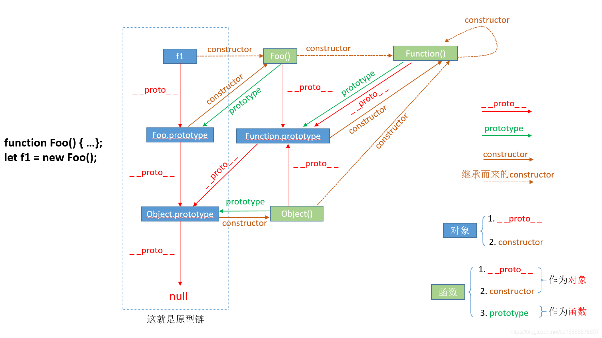

# Introducing JavaScript objects

## JavaScript object basics

### Object basics

[myPen](https://codepen.io/pen/?editors=0011)

- **properties**: data items
- **methods**: functions
- **object literal**: we've literally written out the object contents as we've come to create it.

### Bracket notation

```js
person.age
person.name.first
```

```js
person['age']
person['name']['first']
```

One useful aspect of bracket notation is that it can be used to set not only member values _dynamically_, but _member names_ too.

Adding a property to an object using the method above isn't possible with _dot notation_, which _can only accept a literal member name, not a variable value_ pointing to a name.('.'只能接受对象成员的字面量，'[]'可以接受变量作为参数)

```js
let myDataName = nameInput.value;
let myDataValue = nameValue.value;

person[myDataName] = myDataValue;
```

### Setting object members

你可以在_对象外_直接新建属性或方法

```js
const person = {
  name: ['Bob', 'Smith'],
  age: 32,
  gender: 'male',
  interests: ['music', 'skiing'],
  bio: function() {
    alert(this.name[0] + ' ' + this.name[1] + ' is ' + this.age + ' years old. He likes ' + this.interests[0] + ' and ' + this.interests[1] + '.');
  },
  greeting: function() {
    alert('Hi! I\'m ' + this.name[0] + '.');
  }
};

//为object增加属性和方法
person['eyes'] = 'hazel';
person.farewell = function() { alert("Bye everybody!"); }
```

### You've been using objects all along

#### document object model（DOM）

For each webpage loaded, an instance of Document is created, called document, which represents the entire page's structure, content, and other features such as its URL.

Note that built in objects and APIs _don't always_ create object instances automatically.

> As an example, the Notifications API — which allows modern browsers to fire system notifications — requires you to instantiate a new object instance using the constructor for each notification you want to fire.

## Object-oriented JavaScript for beginners

### Object-oriented programming — the basics

- 实例化：the object instance is instantiated from the class.
- 继承
- 多态(polymorphism): The fancy word for the ability of multiple object types to implement the same functionality is polymorphism. 一个接口，多种方法，如C++中，多态是在不同继承关系的类对象，去调用同一函数，产生了不同的行为。

### Constructors and object instances

[myPen-oojs](https://codepen.io/pen/?editors=1000)

JavaScript uses special functions called **constructor functions** to _define and initialize objects_ and their features.

 _The constructor function is JavaScript's version of a class._

A constructor function name usually starts with **a capital letter**

the **new** keyword is used to tell the browser we want to create a new object instance.

```js
function Person(name) {
  this.name = name;
  this.greeting = function() {
    alert('Hi! I\'m ' + this.name + '.');
  };
}

let person1 = new Person('Bob');
let person2 = new Person('Sarah');
```

```js
//After the new objects have been created, the person1 and person2 variables contain the following objects:
{
  name: 'Bob',
  greeting: function() {
    alert('Hi! I\'m ' + this.name + '.');
  }
}

{
  name: 'Sarah',
  greeting: function() {
    alert('Hi! I\'m ' + this.name + '.');
  }
}
```

### Other ways to create object instances

#### The `Object()` constructor

you can use the `Object()` constructor to create a new object. Yes, even generic objects have a constructor, which _generates an empty object_.

```js
let person1 = new Object();

person1.name = 'Chris';
person1['age'] = 38;
person1.greeting = function() {
  alert('Hi! I\'m ' + this.name + '.');
};
```

```js
let person1 = new Object({
  name: 'Chris',
  age: 38,
  greeting: function() {
    alert('Hi! I\'m ' + this.name + '.');
  }
});
```

#### Using the `create()` method

JavaScript has a built-in method called `create()` that allows you to _create object instances without first creating constructors_, especially if they are creating only a few instances of an object.

With it, _you can create a new object, using an existing object as the prototype of the newly created object._

## Object prototypes

### A prototype-based language?

**Prototypes** are the mechanism by which _JavaScript objects inherit features from one another_.

**prototype chain** : An object's prototype object may also have a prototype object, which it inherits methods and properties from, and so on. This is often referred to as a prototype chain, and explains why different objects have properties and methods defined on other objects available to them.

### Understanding prototype objects

_valueOf()_ returns the value of the object it is called on.

the methods and properties _are not copied_ from one object to another in the **prototype chain**. They _are accessed by walking up the chain_ as described above.

The prototype chain is _traversed only while retrieving properties_. If properties are set or deleted directly on the object, the prototype chain is not traversed.

Since ECMAScript 2015, you can access an object's prototype object indirectly via `Object.getPrototypeOf(obj)`. 相当于`obj.__proto__``obj.[[Prototype]]`

#### [__proto__  prototype constructor](https://blog.csdn.net/cc18868876837/article/details/81211729)



- __proto__和constructor属性是对象所独有的；
- prototype属性是函数所独有的，因为函数也是一种对象，所以函数也拥有__proto__和constructor属性。
- __proto__属性的作用就是当访问一个对象的属性时，如果该对象内部不存在这个属性，那么就会去它的__proto__属性所指向的那个对象（父对象）里找，一直找，直到__proto__属性的终点null，再往上找就相当于在null上取值，会报错。通过__proto__属性将对象连接起来的这条链路即我们所谓的原型链。
- prototype属性的作用就是让该函数所实例化的对象们都可以找到公用的属性和方法，即f1.__proto__ === Foo.prototype
- constructor属性的含义就是指向该对象的构造函数，所有函数（此时看成对象了）最终的构造函数都指向Function

prototype is a property containing an object on which you define members that you want to be inherited.

### Revisiting create()

The `Object.create()` method creates a new object, using an existing object as the prototype of the newly created object.

```js
let person2 = Object.create(person1);
person2.__proto__ === person1 //true
```

### The constructor property

Every _constructor function_ has a prototype property whose value is an object containing a **constructor property**. This constructor property _points to the original constructor function_.

A clever trick is that you can put parentheses onto the end of the constructor property (containing any required parameters) to create another object instance from that constructor.

```js
let person3 = new person1.constructor('Karen', 'Stephenson', 26, 'female', ['playing drums', 'mountain climbing']);
```

`instanceof` _运算符_用于检测构造函数的 prototype 属性是否出现在某个实例对象的原型链上。

```js
//语法
object instanceof constructor

```

### Modifying prototypes

[myPen-oojs3](https://codepen.io/pen/?editors=0010)

修改 constructor 的 prototype, 由这个 constructor 产生的所有 object 的 prototype 都会改变。

The JavaScript **delete** operator _removes a property from an object_; if no more references to the same property are held, it is eventually released automatically.

```js
//语法
delete expression
```

a fairly common pattern for more object definitions is to _define the properties inside the constructor, and the methods on the prototype_

```js
// Constructor with property definitions

function Test(a, b, c, d) {
  // property definitions
}

// First method definition

Test.prototype.x = function() { ... };

// Second method definition

Test.prototype.y = function() { ... };

// etc.
```

## Inheritance in JavaScript

[myPen-oojs-class-inheritance](https://codepen.io/cc2m2/pen/OJgWwzL?editors=0010)

The `call()` _method_ calls a function with a given this value and arguments provided individually.

```js
function Product(name, price) {
  this.name = name;
  this.price = price;
}

function Food(name, price) {
  Product.call(this, name, price);
  this.category = 'food';
}

console.log(new Food('cheese', 5).name);
// expected output: "cheese"
```

Note that if the constructor you are inheriting from _doesn't take its property values from parameters_, you don't need to specify them as additional arguments in `call()`.

```js
function Brick() {
  this.width = 10;
  this.height = 20;
}

function BlueGlassBrick() {
  Brick.call(this);

  this.opacity = 0.5;
  this.color = 'blue';
}
```

### Setting Teacher()'s prototype and constructor reference（继承）

```js
function Teacher(first, last, age, gender, interests, subject) {
  Person.call(this, first, last, age, gender, interests); //! 继承 Property

  this.subject = subject;
}

Teacher.prototype = Object.create(Person.prototype); //! 继承 methods
Teacher.prototype.constructor = Teacher; //! 由于 Teacher.prototype 是从Person.prototype 继承的，如果没有这一行，Teacher.prototype.constructor 返回的是 Person

Teacher.prototype.greeting = function() {
  let prefix;

  if(this.gender === 'male' || this.gender === 'Male' || this.gender === 'm' || this.gender === 'M') {
    prefix = 'Mr.';
  } else if(this.gender === 'female' || this.gender === 'Female' || this.gender === 'f' || this.gender === 'F') {
    prefix = 'Mrs.';
  } else {
    prefix = 'Mx.';
  }

  alert('Hello. My name is ' + prefix + ' ' + this.name.last + ', and I teach ' + this.subject + '.');
};

let teacher1 = new Teacher('Dave', 'Griffiths', 31, 'male', ['football', 'cookery'], 'mathematics');
```

### ECMAScript 2015 Classes

ECMAScript 2015 introduces class syntax to JavaScript as a way to write reusable classes using easier, cleaner syntax, which is more similar to classes in C++ or Java. （IE不支持）

```js
class Person {
  constructor(first, last, age, gender, interests) {
    this.name = {
      first,
      last
    };
    this.age = age;
    this.gender = gender;
    this.interests = interests;
  }

  greeting() {
    console.log(`Hi! I'm ${this.name.first}`);
  };

  farewell() {
    console.log(`${this.name.first} has left the building. Bye for now!`);
  };
}

//We can now instantiate object instances using the new operator, in just the same way as we did before:
let han = new Person('Han', 'Solo', 25, 'male', ['Smuggling']);
han.greeting();
// Hi! I'm Han

let leia = new Person('Leia', 'Organa', 19, 'female', ['Government']);
leia.farewell();
// Leia has left the building. Bye for now
```

#### Inheritance with class syntax

To create a subclass we use the **extends** keyword to tell JavaScript the class we want to base our class on.

The **super** keyword is used to access and call functions on an object's parent.

```js
class Teacher extends Person {
  constructor(first, last, age, gender, interests, subject, grade) {
    super(first, last, age, gender, interests);

    // subject and grade are specific to Teacher
    this.subject = subject;
    this.grade = grade;
  }
}
```

### Getters and Setters

Getters and setters work in pairs. A **getter** returns the current value of the variable and its corresponding **setter** changes the value of the variable to the one it defines.

```js
class Teacher extends Person {
  constructor(first, last, age, gender, interests, subject, grade) {
    super(first, last, age, gender, interests);
    // subject and grade are specific to Teacher
    this._subject = subject; // We use _ to create a separate value in which to store our name property. 
    this.grade = grade;
  }

  get subject() {
    return this._subject;
  }

  set subject(newSubject) {
    this._subject = newSubject;
  }
}

// Check the default value
console.log(snape.subject) // Returns "Dark arts"(初始化的值)

// Change the value
snape.subject = "Balloon animals" // Sets _subject to "Balloon animals"

// Check it again and see if it matches the new value
console.log(snape.subject) // Returns "Balloon animals"

```

## Working with JSON

### No, really, what is JSON?

- a text-based data format
- it can be used independently from JavaScript
- JSON exists as a string with a specified data format — it contains only properties, no methods.
- can be stored in its own file, a text file with an extension of .json
- double quotes

```JSON
[
  {
    "name": "Molecule Man",
    "age": 29,
    "secretIdentity": "Dan Jukes",
    "powers": [
      "Radiation resistance",
      "Turning tiny",
      "Radiation blast"
    ]
  },
  {
    "name": "Madame Uppercut",
    "age": 39,
    "secretIdentity": "Jane Wilson",
    "powers": [
      "Million tonne punch",
      "Damage resistance",
      "Superhuman reflexes"
    ]
  }
]
```

### Obtaining the JSON

To obtain the JSON, we use an _API_ called `XMLHttpRequest` (often called **XHR**). This is a very useful JavaScript object that allows us to make network requests to retrieve resources from a server via JavaScript (e.g. images, text, JSON, even HTML snippets), meaning that we can update small sections of content without having to reload the entire page. 

[myPen-JSON](https://codepen.io/cc2m2/pen/wvegQmB?editors=0010)

```js
let requestURL = 'https://mdn.github.io/learning-area/javascript/oojs/json/superheroes.json'; //获取json文件地址
let request = new XMLHttpRequest(); //创建对象
request.open('GET', requestURL); //至少两个参数，第一个参数可以改
request.responseType = 'json'; //告诉XHR服务器会返回JSON
request.send(); //send the request
request.onload = function() { 
  const superHeroes = request.response; //接收返回的JSON数据，相当于保存在superHeroes这个对象中
  populateHeader(superHeroes); //通过js（对象）来调用数据
}

function populateHeader(obj) {
  const myH1 = document.createElement('h1');
  myH1.textContent = obj['squadName'];
  header.appendChild(myH1);

  const myPara = document.createElement('p');
  myPara.textContent = 'Hometown: ' + obj['homeTown'] + ' // Formed: ' + obj['formed'];
  header.appendChild(myPara);
}
```

### Converting between objects and text

sometimes we receive a _raw JSON string_, and we need to _convert it to an object_ ourselves. (JSON string -> object)

And when we want to send a JavaScript object across the network, we need to convert it to JSON (a string) before sending. (object -> JSON string)

- `parse()`: Accepts a JSON string as a parameter, and returns the corresponding JavaScript object. (JSON string -> object)

```js
request.open('GET', requestURL);
request.responseType = 'text'; // now we're getting a string!
request.send();

request.onload = function() {
  const superHeroesText = request.response; // get the string from the response
  const superHeroes = JSON.parse(superHeroesText); // convert it to an object
  populateHeader(superHeroes);
  showHeroes(superHeroes);
}
```

- `stringify()`: Accepts an object as a parameter, and returns the equivalent JSON string. (object -> JSON string)

```js
let myObj = { name: "Chris", age: 38 };
myObj
let myString = JSON.stringify(myObj);
myString
```
