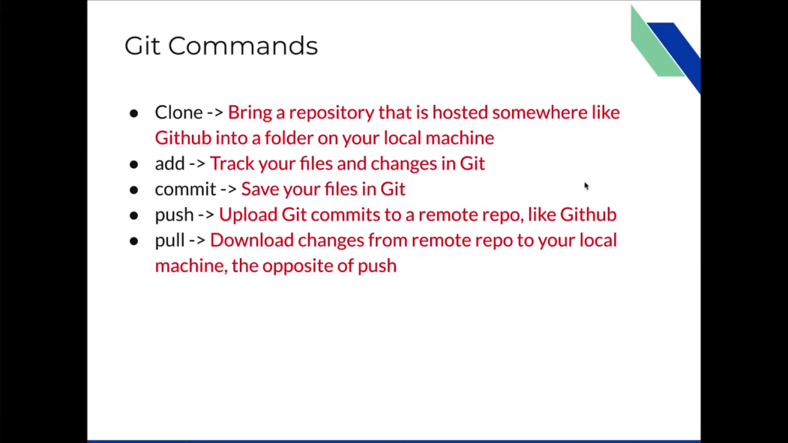

# git和github

## github找资源

-找百科大全 awesome xxx
-找例子 xxx sample
-找项目空架子 xxx starter/ xxx boilerplate
-找教程 xxx tutorial

## git commands

### basic

- git init
  - 初始化当前目录为git本地仓库
- rm -rf .git
  - 删除.git文件夹
- git pull
- git push
- git clone
  - 获取远程仓库

### add

- git add
  - git add .
    - 将_当前目录下_的全部文件添加到暂存区（追踪文件）
  - git add < file>
    - 将某一文件添加到暂存区
  - git add -A
    - 将当前仓库的全部文件添加到暂存区
- git restore --staged < file>
  - 将暂存区的某一文件删除（不追踪某一文件）

### commit

- git commit -m "commit注释"
  - '-m'表示message
- git log
  - 查看每次git commit的详细信息
- git log --oneline
  - 查看每次git commit的简略信息
- git show < git log中每次commit的hash>
  - 查看这次git commit的详细信息
- git diff
  - 比较当前工作区和暂存区的差异
- git commit --amend -m "注释"
  - 更改上次的注释内容

### branch

- git branch
- 查看当前branchP
- git branch -r
  - 查看github上的branch
- git branch -a
  - 查看所有branch
- git branch xxx
  - 创建一个名为xxx的分支
- git checkout xxx
  - 切换到名为xxx的分支
- git checkout -
  - 切换到上一个分支
- git push -u origin xxx
  - 将xxx分支push到github
- git checkout -b xxx
  - 创建xxx分支并切换到xxx分支
- git branch -d xxx
  - 删除xxx分支，当前要位于main分支下

### dealing with conflict

先pull到本地，再解决conflict，再push

### rebase

get the latest commits from the main and add our commits on top of it.

- git pull -r origin main
  - "-r"代表rebase
  - rebase到当前分支的第一个commit 处理main和当前分支的conflict
- git rebase --continue
  - rebase到当前分支的下一个commit 继续处理conflict
- git push -f
  - "-f" force
  - rebase main分支后，github不知道我们的分支已经包含最新的main, 这时可以强制push.
